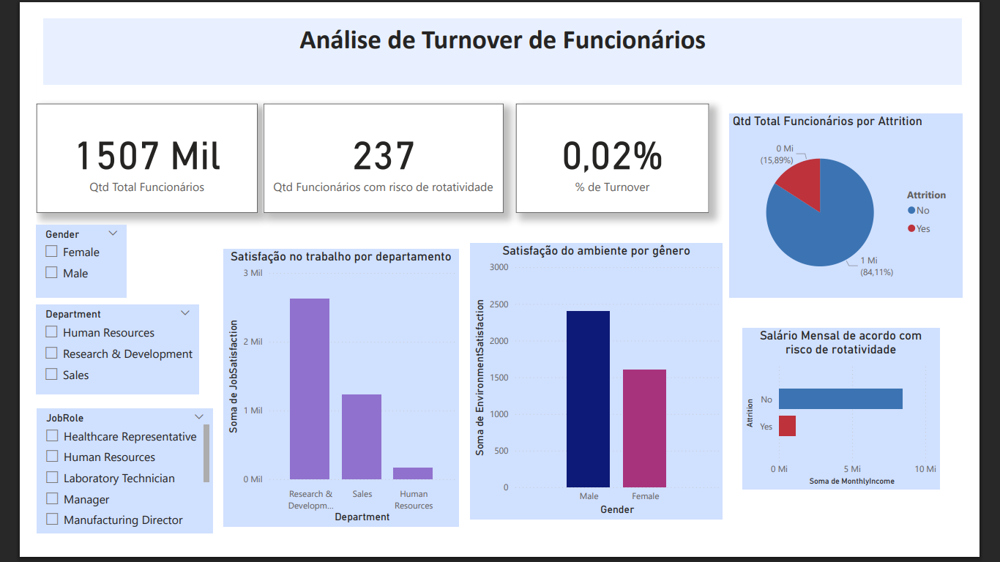

**Análise de Turnover (Rotatividade) de Funcionários**

## Sobre o Projeto
Este projeto tem como objetivo analisar o turnover (rotatividade) de funcionários de uma empresa fictícia, identificando padrões e fatores que podem estar relacionados à saída de colaboradores.  

Foram realizadas etapas de **limpeza de dados**, **análise exploratória** e **visualização interativa** para auxiliar na tomada de decisões estratégicas.

---

## Etapas do Projeto

### 1. Limpeza de Dados
- Remoção de valores nulos e inconsistências.
- Ajuste de tipos de dados (numéricos e categóricos).
- Filtragem das colunas usadas no cenário.
- Detecção e análise de **outliers** (ex.: `MonthlyIncome`).

### 2. Análise Exploratória
- Contagem de funcionários com e sem risco de rotatividade (`Attrition` = "Yes"/"No").
- Análise da distribuição de variáveis como:
  - `JobSatisfaction`
  - `EnvironmentSatisfaction`
  - `MonthlyIncome`
  - `YearsAtCompany`
- Identificação de cargos e departamentos mais afetados pelo turnover.
- Comparação de médias de renda e tempo de empresa entre quem ficou e quem saiu.

### 3. Visualização no Power BI
O dashboard a seguir foi desenvolvido para monitorar e compreender a rotatividade de funcionários. Ele apresenta indicadores-chave como total de colaboradores, quantidade e percentual de funcionários com risco de saída, além de análises de satisfação no trabalho e no ambiente por departamento e gênero. Também inclui a distribuição de turnover por cargo e departamento, permitindo identificar áreas críticas e subsidiar ações estratégicas de retenção.

---

## Tecnologias Utilizadas
- **Python** (Pandas, Matplotlib, Seaborn) – limpeza e análise exploratória
- **Power BI** – visualização e dashboard interativo
- **Git/GitHub** – versionamento do projeto

---

## 📈 Principais Insights
- Determinados departamentos apresentam maiores taxas de turnover.
- Funcionários com menor tempo de empresa tendem a ter maior rotatividade.
- Há diferença significativa na renda média entre quem saiu e quem permaneceu.
- Satisfação no trabalho e com o ambiente impactam diretamente na permanência.

